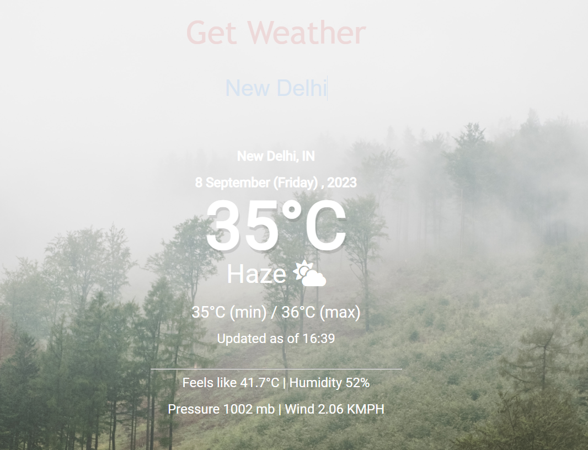
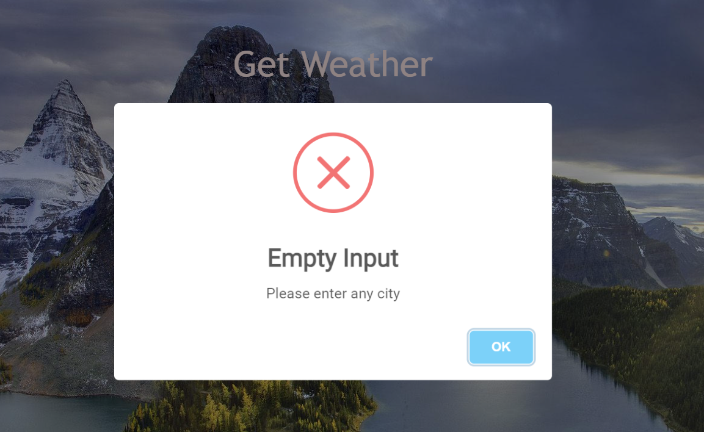
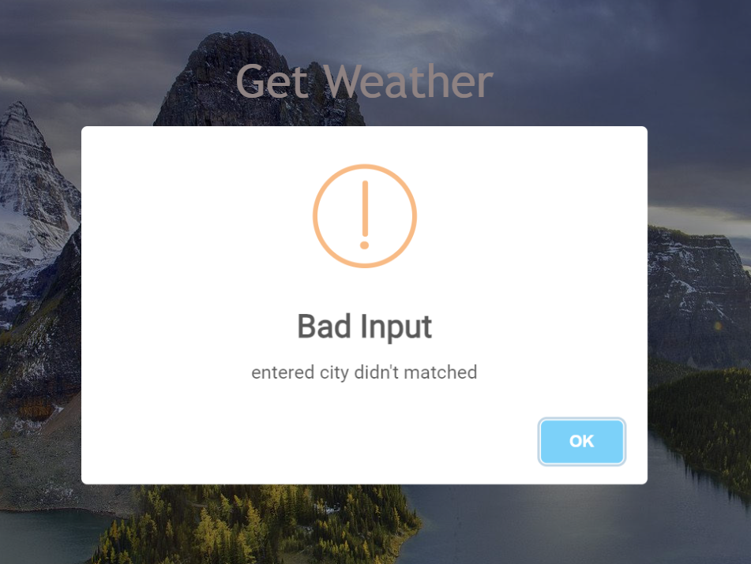

# Weather_webApp

## I used open weather API to fetch data 

### This  web project done in HTLML,CSS ,JavaScript
 
### Features of the project.

* Provides dynamic weather data such as temperature, minimum and maximum temperature, feels-like temperature,   humidity, pressure, and wind speed.
* Uses dynamic background images that change according to the weather status, enhancing the user experience.
* Utilizes dynamic weather icons that change to represent the current weather conditions.
* Displays basic weather information in a user-friendly manner.
* Includes input validation to ensure the city name is not empty.
* Provides an alert or user-friendly message if the entered city name does not match data from the API.

### Snapshot

* Default 

* when you entered any valid city
 

* when you did'nt entered anything 
 

* when entered city did'nt matched with data
 

